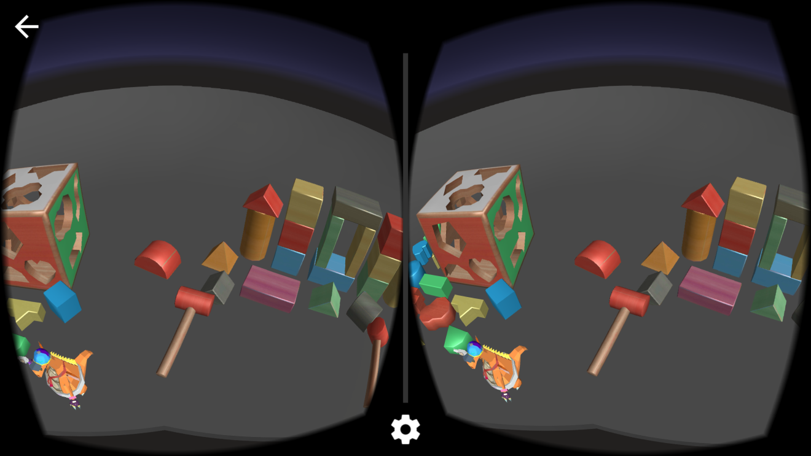
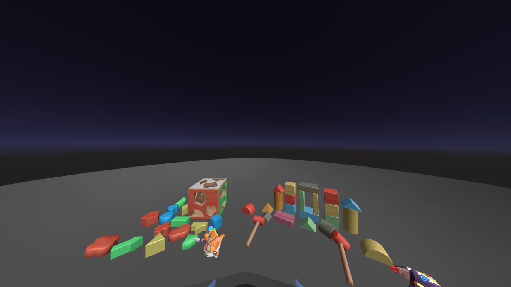

# Ximmerse Demos

This folder contains several demos that are compatible with Ximmerse devices.

**Table of Contents**
- [Toy Brick (for Cardboard)](#anchor-ToyBrickCardboard) - <kbd>Toy Brick Cardboard.apk</kbd>  
- [Toy Brick (for Gear VR)](#anchor-ToyBrickGearVR) - <kbd>Toy Brick GearVR.apk</kbd>  
- [Toy Brick Demo (for Oculus DK2)](#anchor-ToyBrickOculus) - <kbd>Toy Brick (DK2).zip</kbd>   

* * *

## Toy Brick (for Cardboard) - <kbd>Toy Brick Cardboard.apk</kbd>
This demo places a desk of toy bricks in front of you that you can interact with. Note that this demo can be used on most Cardboard-compatible headsets. This demo will NOT work as-is on a Samsung Gear VR. See Toy Brick (for Gear VR) instructions below.

You can refer to our [Cardboard Tutorial Video](https://www.youtube.com/watch?v=IMGgXu9qwhA) for demonstration.

## Toy Brick (for Gear VR) - <kbd>Toy Brick GearVR.apk</kbd>
You can refer to our [SDK Doc](http://ximmerse.github.io/SDK_Doc/#7-developing-with-gear-vr) or [Gear VR Tutorial Video](https://www.youtube.com/watch?v=SDIEa9DMquA) for step-by-step instructions.

As the Toy Brick demo for Gear VR is not yet available on the Oculus/Samsung store, you will need to provide us with your device-specific OSIG for us to provide you with a unique APK to install on your mobile device.

> ++Important++: This demo works ONLY on the ++Samsung Galaxy S6++ and ++Samsung Gear VR Innovator Edition for S6++.

Contact ++support@ximmerse.com++ with the title *"Gear VR APK Application"* if you wish to apply for a unique Toy Brick demo APK. Note that you will have to turn on *"Developer Mode"* in the Gear VR Service app to get this demo running.

## Toy Brick Demo (for Oculus DK2) - <kbd>Toy Brick (DK2).zip</kbd>
This is the Toy Brick demo that runs on the Oculus DK2.

