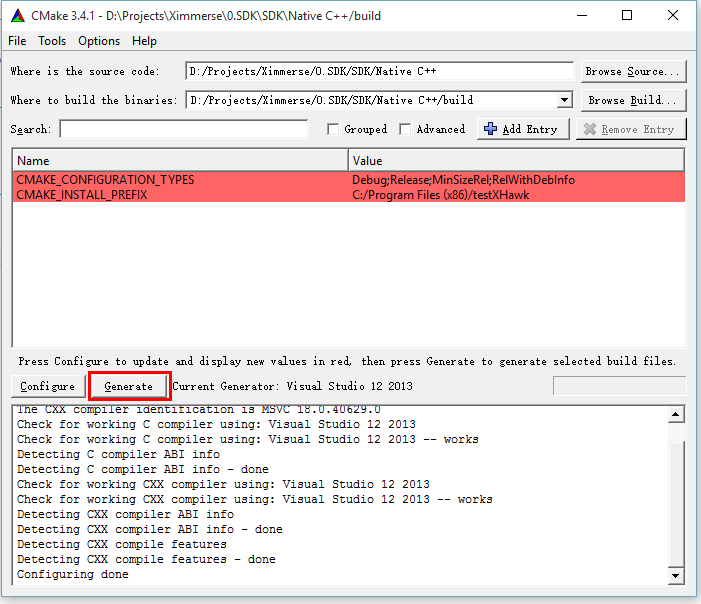

Ximmerse Native C++ SDK
============

This folder contains our Native C++ SDK.

## How to use (via CMake)

1. Download Ximmerse Native C++ SDK to your PC. Suppose it is saved in **"D:\Projects\Ximmerse\0.SDK\SDK\Native C\+\+"**.
2. Run CMake (v2.6 or above).
3. Input the path of the Ximmerse Native C++ SDK in **"Where is the source code"** and input where you want to build in **"Where to build the binaries"**. And then press **`Configure`**.

	

4. Select the generator that you want. Suppose **Visual Studio 12 2013** (you should have this installed first) is used here. And then press **`Finish`**.

	

5. Once the configuration step is done, press **`Generate`**.

	

6. The project should be already generated under the build path, i.e. path you input in **"Where to build the binaries"**.

	

7. Double click file **`testXHawk.sln`** to run it in **Visual Studio 12 2013**.
8. Connect X-Hawk and X-Cobra by following the instructions in [**SDK Doc - Chapter 8 Developing with PC (Windows)**](http://ximmerse.github.io/SDK_Doc/#8-developing-with-pc-(windows)).
9. Copy corresponding **`X-Hawk.dll`** (e.g. **`Native C++\x86\Debug\X-Hawk.dll`** in this case) to the build path.
10. Build the project and run project **`testXHawk`** in **Visual Studio 12 2013**. You will be able to see the status of X-Cobra (refresh every 1s) in the console window.

	
