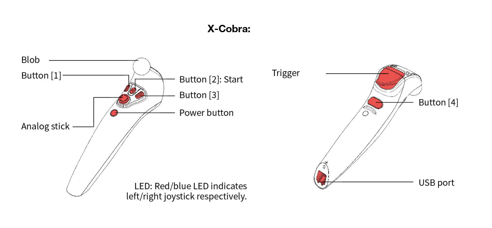
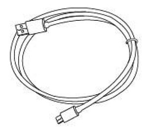
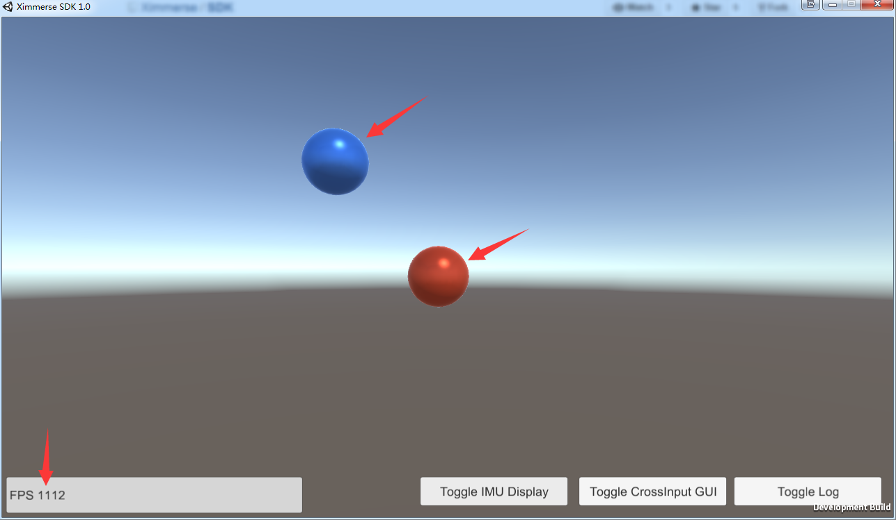
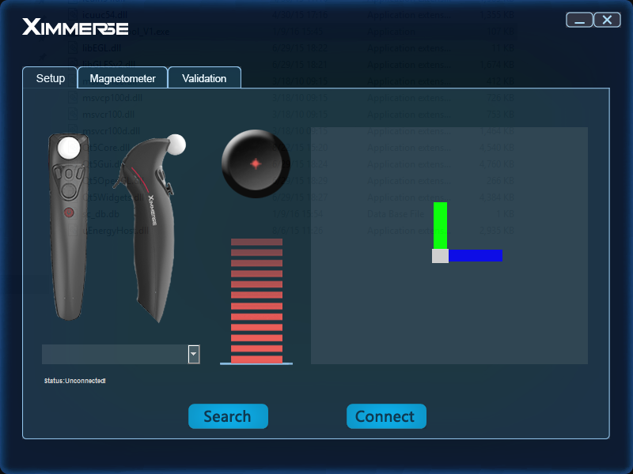
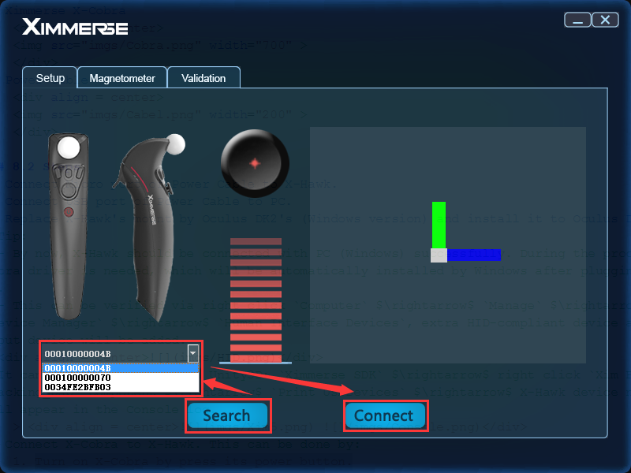
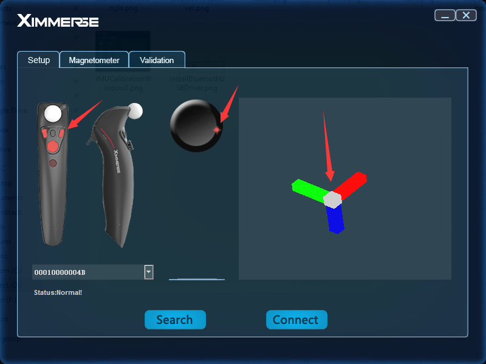

<h1>Tools Instructions</h1>

## Test Demo
### Hardware Requirement
1. Ximmerse X-Hawk
	

	
	

2. Ximmerse X-Cobra
	

	
	

3. Power Cable
	

	
	

### Steps
1. Connect Micro port of Power Cable to X-Hawk.
2. Connect USB port of Power Cable to PC.
3. Replace X-Hawk's mount by Oculus DK2's (Windows version) and install it to Oculus DK2.
> Tip:
> - By now, X-Hawk should be connected with PC (Windows) successfully. During the process, no extra driver is needed, which will be automatically installed by Windows after plugging it to PC.
> - This can be verified via right click `Computer` $\rightarrow$ `Manage` $\rightarrow$ `Device Manager` $\rightarrow$ `Human Interface Devices`, extra HID-compliant device and USB input device will be added.
> 

4. Connect X-Cobra to X-Hawk. This can be done by:
	1. Turn on X-Cobra by press its power button.
	2. Put X-Cobra close to X-Hawk. It will be successfully connected once it vibrates.
5. Run test demo by following steps:
	1. Download test demo from [here](https://github.com/Ximmerse/SDK/blob/master/Tools/Test_demo.zip?raw=true) (ZIP file).
	2. Unzip the file to your PC.
	3. Double click `Test_demo` $\rightarrow$ `Test_demo.exe` to run. You will see the real-time status of X-Cobra (assume two X-Cobras are connected) that are represented by 3D virtual balls in the program window, with FPS information shown in the left bottom.
		
	4. More information. More information can be obtained, including:
		- IMU information: click `Toggle IMU Display` button to show detailed IMU information.
			
		- CrossInput GUI: click `Toggle CrossInput GUI` button to show detailed CrossInput GUI information, including position, rotation, stick, trigger and buttons.
			
		- Log: click `Toggle Log` button to show detailed log information.
			

---
## IMU Calibration
### Hardware Requirement
1. Ximmerse X-Cobra
	

	
	

2. Bluetooth USB Dongle
 	

	
	

### Steps
1. Plugin Bluetooth USB Dongle to PC.
2. *(optional)* Install Bluetooth driver.
	> Normally, the driver will be installed automatically, which can be verified by checking whether there is a `CSR BlueCore Bluetooth` under `Device Manager` $\rightarrow$ `Universal Serial Bus controllers`.
	> 
	> If you can not find it there, you will need to install the driver mannually. Steps are:
	> 1. Download the driver from [here](https://github.com/Ximmerse/SDK/blob/master/Driver/CSR8510%20Bluetooth%20USB%20Dongle.zip?raw=true) (ZIP file).
	> 2. Unzip the file to your PC.
	> 3. Depending on your PC system:
	> 	- For Win7: `CSR8510 Bluetooth USB Dongle` $\rightarrow$ `Windows 7` $\rightarrow$ `win32/64` $\rightarrow$ `CSRBlueCoreUSB.inf` $\rightarrow$ right click $\rightarrow$ `Install`.
	> 	- For Win8 or Win10: `CSR8510 Bluetooth USB Dongle` $\rightarrow$ `Windows 8` $\rightarrow$ `win32/64` $\rightarrow$ `CSRBlueCoreUSB.inf` $\rightarrow$ right click $\rightarrow$ `Install`.
	> 
3. Run IMU calibration tool by following steps:
	1. Download IMU calibration tool from [here](https://github.com/Ximmerse/SDK/blob/master/Tools/IMU_cal_tool_V1.zip?raw=true) (ZIP file).
	2. Unzip the file to your PC.
	3. Double click `IMU_cal_tool_V1` $\rightarrow$ `IMU_Cal_Tool_V1.exe` to run. You will see the calibration program like this:
		
4. Connect X-Cobra. Steps are:
	1. Turn on X-Cobra by press its power button and put it close to the PC.
	2. Press the `Search` button in the calibration program.
	3. The available X-Cobra devices will be listed in the dropdown window.
	4. Select the X-Cobra that you want to connect and then press the `Connect` button. X-Cobra will vibrate once it is successfully connected.
		
5. Test X-Cobra. The realtime status of X-Cobra will be displayed in the `Setup` window, including the information of ratotation, axis, button, etc. Wave, press and rotate the X-Cobra to check it out!
	
6. Calibrate X-Cobra.
	> Note: you do not need to do this unless you find that X-Cobra's IMU information is not accurate enough, and make sure there is no magnetic interference nearby, e.g. mobile phones, pads, electric fans, etc.

	1. Click the `Magnetometer` menu in the calibration program to make the magnetometer window active.
		
	2. Make X-Cobra enter calibrate mode by holding buttons [1], [2] and [3] simultaneously for 2 seconds. Once sucessfully, you will see the values of `Magnetometer_X`, `Magnetometer_Y` and `Magnetometer_Z` are changing over time.
	3. Press the `Calibrate` button in the magnetometer window to start calibrating.
		> Tips: You can rotate and move X-Cobra to calibrate it. The goal here is try to make the three yellow bars taller (i.e. values span a large range).
		
	4. Once finished, press `Save` button. The calibration information will be written to X-Cobra.
	5. Make X-Cobra exit the calibrate mode by pressing its power button (the values of `Magnetometer_X`, `Magnetometer_Y` and `Magnetometer_Z` will stop changing).
5. Validation.
	You can also validate X-Cobra's jitter stability status in the following steps:
	1. Put X-Cobra stationary on your desk.
	2. Click the `Validation` menu in the calibration program to make the validation window active.
	3. Press `Stationary Validation` button in the validation window to start.
		