# Tools Instructions

**Table of Contents**  
- ***PC Tools***
	- [1 Tracking HID Tool](#anchor-tracking-hid) - <kbd>PC -> Tracking_hid.zip</kbd>  
	- [2 CrossInputManager Tool](#anchor-crossinputmanager) - <kbd>PC -> CrossInputManager.zip</kbd>  
		- [2.1 InputTest (X-Hawk)](#anchor-inputtest-hawk)  
		- [2.2 InputTest (X-Hawk SDK)](#anchor-inputtest-hawk-sdk)  
		- [2.3 InputTest (X-Cobra)](#anchor-inputtest-cobra)  
		- [2.4 InputTest (X-Swift)](#anchor-inputtest-swift)  
	- [3 X-Console Tool](#anchor-console) - <kbd>PC -> X-Console.zip</kbd>  
	- [4 IMU Calibration Tool](#anchor-imu-cal) - <kbd>PC -> IMU_cal_tool_V1.zip</kbd>  
- ***Mobile Tools***
	- [5 Bluetooth Connect Tool](#anchor-BluetoothSetting) - <kbd>Mobile -> BTconnect.apk</kbd>  
	- [6 CrossInputManager Tool](#anchor-CrossInputManager) - <kbd>Mobile -> CrossInputManager.apk</kbd>  
	- [7 Cardboard Test](#anchor-CardboardTest) - <kbd>Mobile -> CardboardTest.apk</kbd>  

* * *

## 1 Tracking HID Tool - <kbd>PC -> Tracking_hid.zip</kbd>
This tool enables to obtain detailed info of X-Cobras via X-Hawk. It is also helpful to validate

1. whether X-Hawk is sucessfully connected to PC.
2. whether X-Cobra is sucessfully connected to X-Hawk.

### Hardware Requirement
1. Ximmerse X-Hawk
	

	
	

2. Ximmerse X-Cobra
	

	
	

3. Power Cable
	

	
	

### Steps
> Tip: You can refer to our [Open Box Tutorial Video](https://youtu.be/VZ33MuYHGzU?t=3s) (0:00 -> 1:16) for demonstration.

1. Connect Micro port of Power Cable to X-Hawk.
2. Connect USB port of Power Cable to PC.
	> Tip:
	> - By now, X-Hawk should be connected with PC (Windows) successfully. During the process, no extra driver is needed, which will be automatically installed by Windows after plugging it to PC.
	> - This can be verified via right click `Computer -> Manage -> Device Manager -> Human Interface Devices`, extra HID-compliant device and USB input device will be added.
	> 
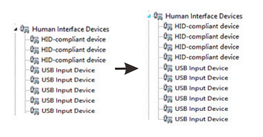

3. Connect X-Cobra to X-Hawk. This can be done by:
	1. Turn on X-Cobra by press its power button.
	2. Put X-Cobra close to X-Hawk. It will be successfully connected once it vibrates.
4. Run tracking HID demo by following steps:
	1. Download tracking HID demo from [here](https://github.com/Ximmerse/SDK/blob/master/Tools/Tracking_hid.zip?raw=true) (ZIP file).
	2. Unzip the file to your PC.
	3. Double click `Tracking_hid -> Tracking_hid.exe` to run. You will see the real-time status of X-Cobra (assume two X-Cobras are connected) that are represented by 3D virtual balls in the program window, with FPS information shown in the left bottom.
		
	4. More information. More information can be obtained, including:
		- IMU information: click `Toggle IMU Display` button to show detailed IMU information.
			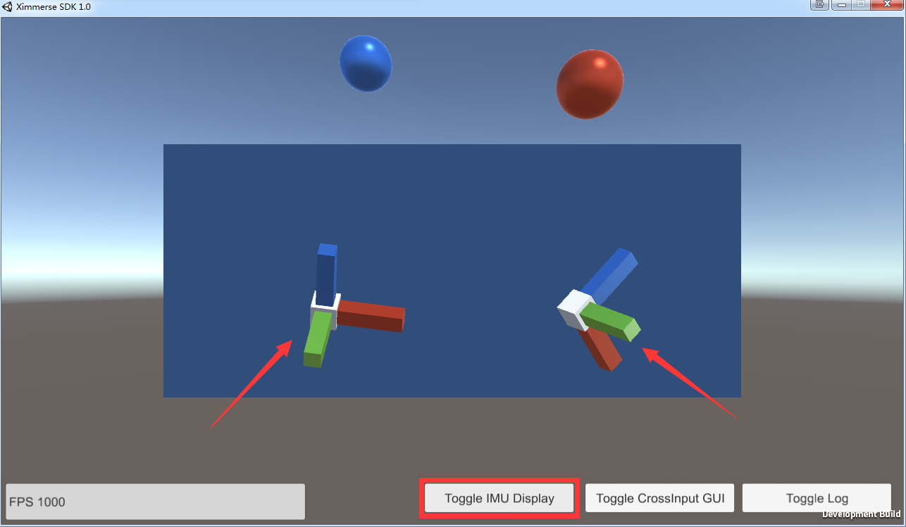
		- CrossInput GUI: click `Toggle CrossInput GUI` button to show detailed CrossInput GUI information, including position, rotation, stick, trigger and buttons.
			
		- Log: click `Toggle Log` button to show detailed log information.
			

* * *
## 2 CrossInputManager Tool - <kbd>PC -> CrossInputManager.zip</kbd>
This tool enables to obtain detailed info of 1) X-Cobras via X-Hawk, 2) X-Cobras via Bluetooth and 3) X-Swift via Bluetooth. It is also helpful to validate

1. For X-Cobras via X-Hawk (in ++InputTest (X-Hawk)++ and ++InputTest (X-Hawk SDK)++ modes):
	- whether X-Hawk is sucessfully connected to PC.
	- whether X-Cobra is sucessfully connected to X-Hawk.
2. For X-Cobras via Bluetooth (in ++InputTest (X-Cobra)++ mode): whether X-Cobra is sucessfully connected to PC via Bluetooth.
3. For X-Swift via Bluetooth (in ++InputTest (X-Cobra)++ mode): whether X-Swift is sucessfully connected to PC via Bluetooth.

### 2.1 `InputTest (X-Hawk)`
The hardware requirement and setup steps are the same as the above tracking HID demo except the last step replaced by the following:

- Run CrossInputManager by following steps
	1. Download CrossInputManager from [here](https://github.com/Ximmerse/SDK/blob/master/Tools/CrossInputManager.zip?raw=true) (ZIP file).
	2. Unzip the file to your PC.
	3. Double click `CrossInputManager -> CrossInputManager.exe` to run.
	4. Click `InputTest (X-Hawk)` button to activate this mode.

Once done, you will be able to obtain the detailed X-Cobra's information (including position, rotation, axis, trigger and buttons, etc.) through X-Hawk.

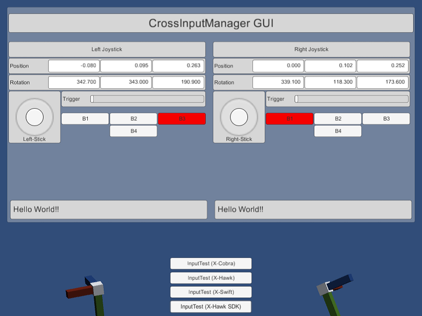

### 2.2 `InputTest (X-Hawk SDK)`
The hardware requirement and setup steps are the same as the above [InputTest (X-Hawk) demo](#anchor-inputtest-hawk) except the very last step replaced by the following:

- Click `InputTest (X-Hawk)` button to activate this mode.

Once done, you will be able to obtain the detailed X-Cobra's information (including position, rotation, axis, trigger and buttons, etc.) through X-Hawk in plain text format.

### 2.3 `InputTest (X-Cobra)`
This sample demonstrates how to obtain the detailed X-Cobra's information (including rotation, axis, trigger and buttons, etc.) through Bluetooth USB adapter plugged in PC.

#### Hardware Requirement
1. Ximmerse X-Cobra
	

	
	

2. Bluetooth USB Adapter
 	

	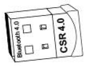
	

#### Steps
1. Un-plugin X-Hawk from PC if it is already connected.
2. Plugin Bluetooth USB Adapter to PC.
2. *(optional)* Install Bluetooth driver.
	> Normally, the driver will be installed automatically, which can be verified by checking whether there is a `CSR BlueCore Bluetooth` under `Device Manager -> Universal Serial Bus controllers`.
	> 

	If you can not find it there, you will need to install the driver mannually. Steps are:
	1. Download the driver from [here](https://github.com/Ximmerse/SDK/raw/master/Driver/CSR8510%20Bluetooth%20USB%20Adapter.zip) (ZIP file).
	2. Unzip the file to your PC.
	3. Depending on your PC system:
		- For Win7: `CSR8510 Bluetooth USB Adapter -> Windows 7 -> win32/64 -> CSRBlueCoreUSB.inf ->` right click `-> Install`.
		- For Win8 or Win10: `CSR8510 Bluetooth USB Adapter -> Windows 8 -> win32/64 -> CSRBlueCoreUSB.inf ->` right click `-> Install`.

			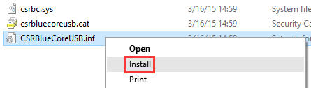
3.  Connect X-Cobra via X-Console tool. This can be done by:
	1. Turn on X-Cobra by press its power button.
	2. Download X-Console tool from [here](https://github.com/Ximmerse/SDK/blob/master/Tools/PC/X-Console.zip?raw=true) (ZIP file).
	2. Unzip the file to your PC.
	3. Double click `X-Console -> X-Console.exe` to run.
		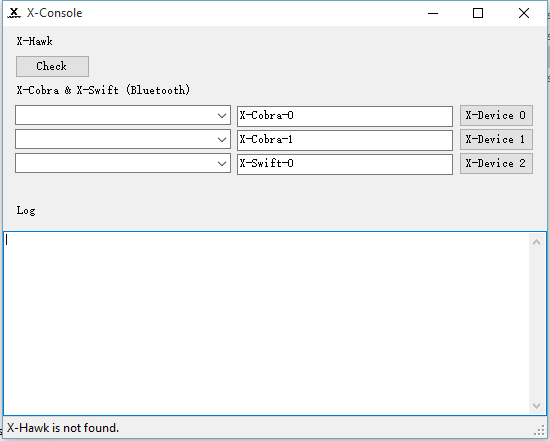
	4. Connect left hand X-Cobra by:
		- Press `X-Device 0` button to scan X-Cobra.
			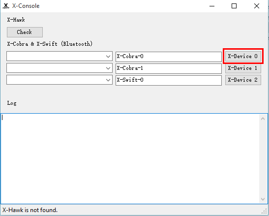
		- After a while, press `Stop Scan` button to stop scanning.
			
		- Select the corresponding X-Cobra via its device BT address (starting with `00:`) in the dropdown list.
			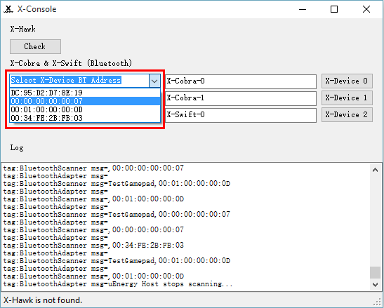
		- The corresponding X-Cobra will be successfully connected once it vibrates.
	5. Connect right hand X-Cobra in the similar way.
		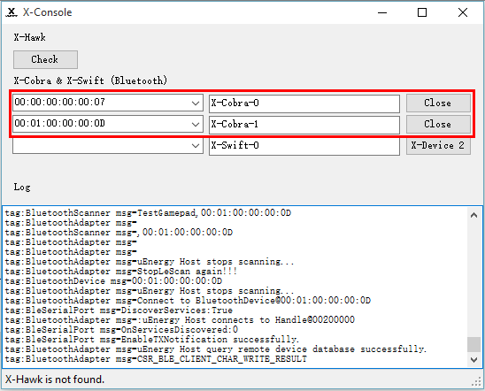
4. Run CrossInputManager by following steps
	1. Download CrossInputManager from [here](https://github.com/Ximmerse/SDK/blob/master/Tools/PC/CrossInputManager.zip?raw=true) (ZIP file).
	2. Unzip the file to your PC.
	3. Double click `CrossInputManager -> CrossInputManager.exe` to run.
	4. Click `InputTest (X-Cobra)` button to activate this mode.

Once done, you will be able to obtain the detailed X-Cobra's information (including rotation, axis, trigger and buttons, etc.) through Bluetooth USB adapter plugged in PC.

### 2.4 `InputTest (X-Swift)`
#### Hardware Requirement
1. Ximmerse X-Swift
	

	
	

2. Bluetooth USB Adapter
 	

	
	

#### Steps
1. Plugin Bluetooth USB Adapter to PC.
2. *(optional)* Install Bluetooth driver.
	> Normally, the driver will be installed automatically, which can be verified by checking whether there is a `CSR BlueCore Bluetooth` under `Device Manager -> Universal Serial Bus controllers`.
	> 

	If you can not find it there, you will need to install the driver mannually. Steps are:
	1. Download the driver from [here](https://github.com/Ximmerse/SDK/raw/master/Driver/CSR8510%20Bluetooth%20USB%20Adapter.zip) (ZIP file).
	2. Unzip the file to your PC.
	3. Depending on your PC system:
		- For Win7: `CSR8510 Bluetooth USB Adapter -> Windows 7 -> win32/64 -> CSRBlueCoreUSB.inf ->` right click `-> Install`.
		- For Win8 or Win10: `CSR8510 Bluetooth USB Adapter -> Windows 8 -> win32/64 -> CSRBlueCoreUSB.inf ->` right click `-> Install`.

			
3.  Connect X-Swift via X-Console tool. This can be done by:
	1. Turn on X-Swift by press its power button.
	2. Download X-Console tool from [here](https://github.com/Ximmerse/SDK/blob/master/Tools/PC/X-Console.zip?raw=true) (ZIP file).
	2. Unzip the file to your PC.
	3. Double click `X-Console -> X-Console.exe` to run.
		
	4. Connect X-Swift by:
		- Press `X-Device 2` button to scan X-Swift.
			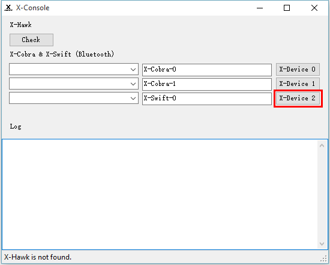
		- After a while, press `Stop Scan` button to stop scanning.
			
		- Select the X-Swift via its device BT address (starting with `00:`) in the dropdown list.
			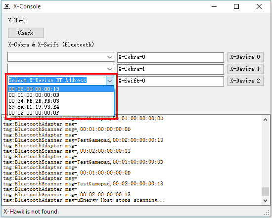
4. Run CrossInputManager by following steps
	1. Download CrossInputManager from [here](https://github.com/Ximmerse/SDK/blob/master/Tools/PC/CrossInputManager.zip?raw=true) (ZIP file).
	2. Unzip the file to your PC.
	3. Double click `CrossInputManager -> CrossInputManager.exe` to run.
	4. Click `InputTest (X-Swift)` button to activate this mode.

Once done, you will be able to obtain the detailed X-Swift's information (i.e. rotation) through Bluetooth USB adapter plugged in PC.

* * *
## 3 X-Console Tool - <kbd>PC -> X-Console.zip</kbd>
This tool has three main functionalities:

1. Check whether X-Hawk has been sucessfully connected to PC.

	This can be done by clicking the `Check` button. If connected sucessfully, message `"X-Hawk is found"` will be displayed in the status bar, otherwise message `"X-Hawk is not found"` will be displayed.
	

2. Scan and connect X-Cobra to PC via Bluetooth.

	Please refer to [here](#anchor-console-cobra) for details.

3. Scan and connect X-Swift to PC via Bluetooth.

	Please refer to [here](#anchor-console-swift) for details.

* * *
## 4 IMU Calibration Tool - <kbd>PC -> IMU_cal_tool_V1.zip</kbd>
This tool is useful for

1. calibrating IMU of X-Cobra.
2. validating wether axis, trigger and buttons, etc of X-Cobra is working.
3. calibrating IMU of X-Swift.

### Hardware Requirement
1. Ximmerse X-Cobra
	

	
	

2. Bluetooth USB Adapter
 	

	
	

### Steps
1. Plugin Bluetooth USB Adapter to PC.
2. *(optional)* Install Bluetooth driver.
	> Normally, the driver will be installed automatically, which can be verified by checking whether there is a `CSR BlueCore Bluetooth` under `Device Manager -> Universal Serial Bus controllers`.
	> 

	If you can not find it there, you will need to install the driver mannually. Steps are:
	1. Download the driver from [here](https://github.com/Ximmerse/SDK/raw/master/Driver/CSR8510%20Bluetooth%20USB%20Adapter.zip) (ZIP file).
	2. Unzip the file to your PC.
	3. Depending on your PC system:
		- For Win7: `CSR8510 Bluetooth USB Adapter -> Windows 7 -> win32/64 -> CSRBlueCoreUSB.inf ->` right click `-> Install`.
		- For Win8 or Win10: `CSR8510 Bluetooth USB Adapter -> Windows 8 -> win32/64 -> CSRBlueCoreUSB.inf ->` right click `-> Install`.

			
3. Run IMU calibration tool by following steps:
	1. Download IMU calibration tool from [here](https://github.com/Ximmerse/SDK/blob/master/Tools/PC/IMU_cal_tool_V1.zip?raw=true) (ZIP file).
	2. Unzip the file to your PC.
	3. Double click `IMU_cal_tool_V1 -> IMU_Cal_Tool_V1.exe` to run. You will see the calibration program like this:
		
4. Connect X-Cobra. Steps are:
	1. Turn on X-Cobra by press its power button and put it close to the PC.
	2. Press the `Search` button in the calibration program.
	3. The available X-Cobra devices will be listed in the dropdown window.
	4. Select the X-Cobra that you want to connect and then press the `Connect` button. X-Cobra will vibrate once it is successfully connected.
		
5. Test X-Cobra. The realtime status of X-Cobra will be displayed in the `Setup` window, including the information of ratotation, axis, button, etc. Wave, press and rotate the X-Cobra to check it out!
	
6. Calibrate X-Cobra.
	> Note: you do not need to do this unless you find that X-Cobra's IMU information is not accurate enough, and make sure there is no magnetic interference nearby, e.g. mobile phones, pads, electric fans, etc.

	1. Click the `Magnetometer` menu in the calibration program to make the magnetometer window active.
		
	2. Make X-Cobra enter calibrate mode by holding buttons [1], [2] and [3] simultaneously for 2 seconds. Once sucessfully, you will see the values of `Magnetometer_X`, `Magnetometer_Y` and `Magnetometer_Z` are changing over time.
	3. Press the `Calibrate` button in the magnetometer window to start calibrating.
		> Tips: You can rotate and move X-Cobra to calibrate it. The goal here is try to make the three yellow bars taller (i.e. values span a large range).
		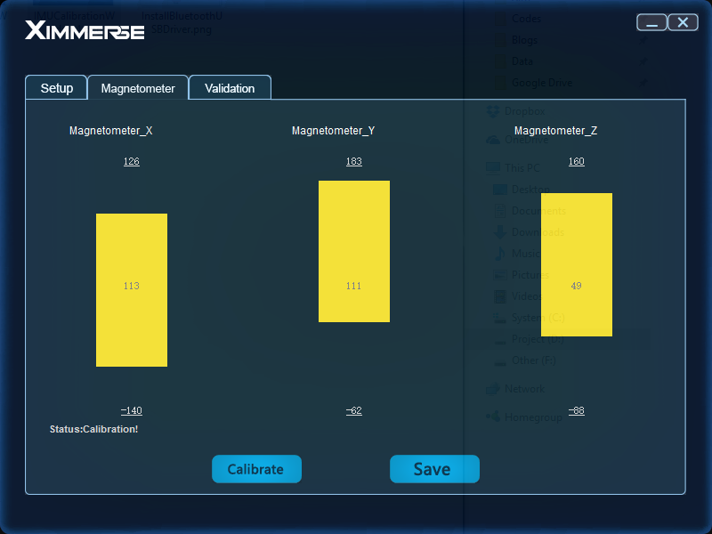
	4. Once finished, press `Save` button. The calibration information will be written to X-Cobra.
	5. Make X-Cobra exit the calibrate mode by pressing its power button (the values of `Magnetometer_X`, `Magnetometer_Y` and `Magnetometer_Z` will stop changing).
5. Validation.
	You can also validate X-Cobra's jitter stability status in the following steps:
	1. Put X-Cobra stationary on your desk.
	2. Click the `Validation` menu in the calibration program to make the validation window active.
	3. Press `Stationary Validation` button in the validation window to start.
		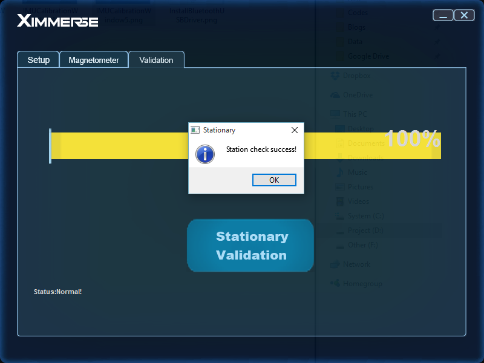

## 5 Bluetooth Connect Tool - <kbd>Mobile -> BTconnect.apk</kbd>
Use this tool to connect the X-Cobra and X-Swift to your Android device via Bluetooth. This tool is used if you want to connect the X-Cobra and X-Swift to your mobile device ++WITHOUT using the X-Hawk++. Once connected and saved (refer to [SDK Doc](http://ximmerse.github.io/SDK_Doc/#9.4-connect-ximmerse-devices-via-bluetooth-in-android) for step-by-step instructions), you can test the connected devices using the CrossInputManager tool below.

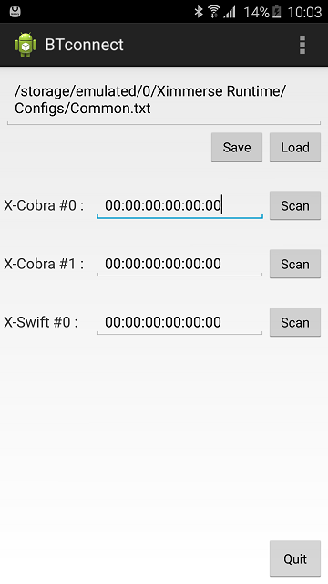

## 6 CrossInputManager Tool - <kbd>Mobile -> CrossInputManager.apk</kbd>
Similar to [CrossInputManager](#anchor-crossinputmanager) tool on PC, you can use this tool with OR without the X-Hawk. Essentially, this tool allows you to test if the X-Cobra and X-Swift is functioning properly on your mobile device. The tool provides the following information:

1. X-Cobra's input data ++via X-Hawk connection++.
2. X-Cobra's input data ++via Bluetooth connection++ to mobile device (without X-Hawk) – see *Bluetooth Setting* above.
3. X-Swift's input data ++via Bluetooth connection++ to mobile device (without X-Hawk) – see *Bluetooth Setting* above.

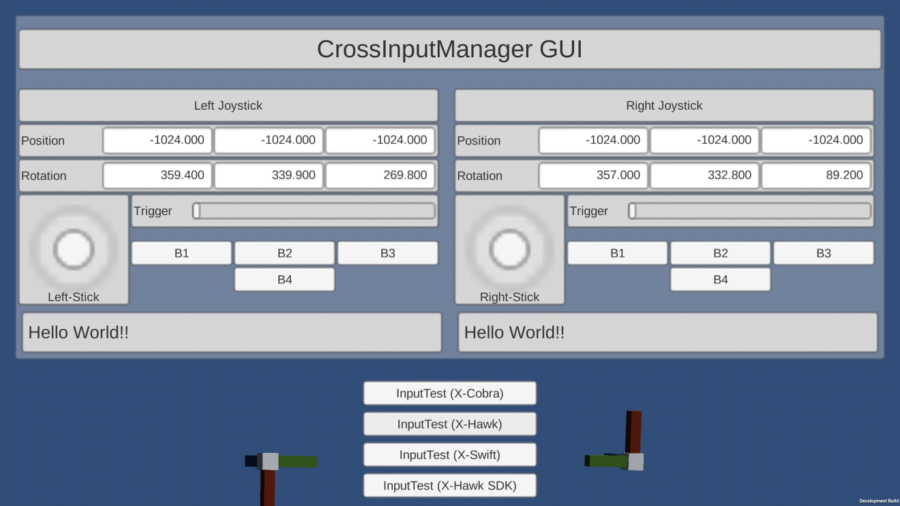

## 7 Cardboard Test - <kbd>Mobile -> CardboardTest.apk</kbd>
The Cardboard Test is a basic demo that shows the position and rotation of the X-Cobra when connected to your mobile device ++via the X-Hawk++.

